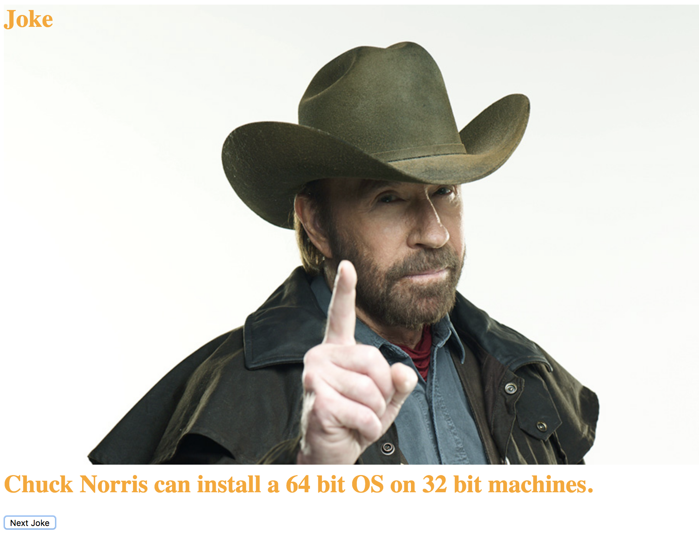

# What does Chuck say about that?

By _Brittany Kerr_ [e-mail me](<mailto:kerrbrittany9@gmail.com>) & _Larry Taylor_ [e-mail me](<mailto:larryjamestaylor@gmail.com>)

## Description

Love Chuck Norris? This web app is a practice in API calls with React and Redux. Play around a little and have a giggle with Chuck Norris.

Users meet Chuck Norris.

Users can click for a true fact.

## Prerequisites

You will need the following things properly installed on your computer:
* [Node.js](https://nodejs.org/) (with NPM)

## Installation

* Open Github site in your browser and copy: https://github.com/kerrbrittany9/api-chuck-norris
* Open Terminal on your computer and follow these steps:
  * `$ cd desktop`
  * `$ git clone <paste repository-url>`
  * `$ cd api-chuck-norris`
  * `$ npm install`

## Development server

Run `npm start` for a dev server. Navigate to `http://localhost:8080/`. The app will automatically reload if you change any of the source files.

## Technologies Used

React.js, Redux, JavaScript, Babel, Jest, react-hot-loader, webpack, Node.js, CSS, HTML, [The Internet Chuck Norris Database](http://www.icndb.com/api/)
